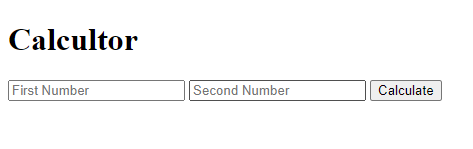
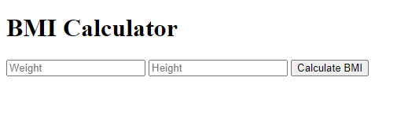

# Calculator
Simple calculator to do addition of two numbers.

# About 
In this project we have used javascript functions to calculate the result of the calculations.

# Tools Used
The main framework used in building the calculator website is HTML, CSS and JavaScript and its components.

# Screenshots

# BMI Calculator
It take two inputs height and weight, returns the BMI of the person.  

# About 
In this project we have used javascript functions to calculate the BMI and display the results.

# Tools Used
The main framework used in building the calculator website is HTML, CSS and JavaScript and its components.

# Screenshots

